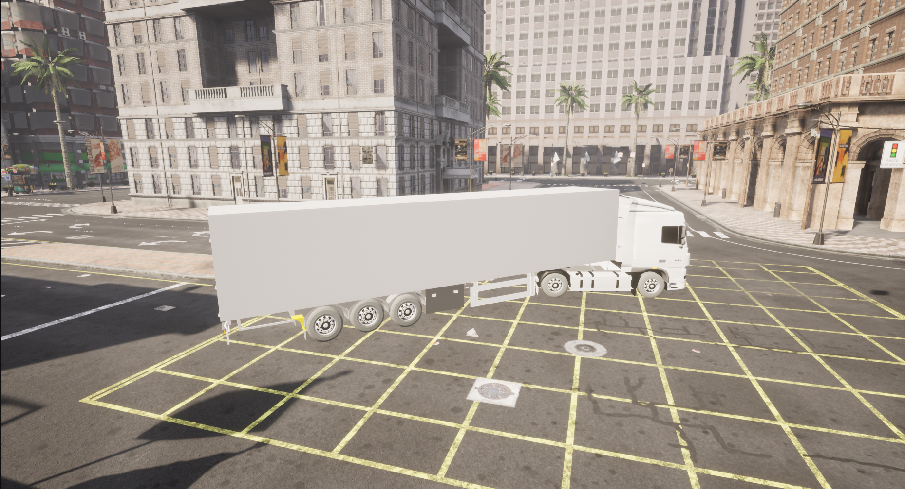

# Improved and Validated Tractor-Semitrailer Vehicle for CARLA Simulator

This repository provides an improved and validated tractor-semi trailer combination model for the [CARLA Simulator](https://carla.org/), based on the source build of CARLA 0.9.14 using Ubuntu 23.04. It includes fixes to existing blueprint issues, addressing several limitations found in earlier implementations and a complete integration workflow for custom vehicle addition and simulator packaging.




---

## Features

📏 Realistic Vehicle Dimensions

The tractor and trailer geometries closely match real-world counterparts (DAF XF95), improving the validity of simulation data and enabling more accurate comparisons with physical tests.

⚙️ Custom Heavy Vehicle Dynamics

The steering of a Firetruck found within CARLA and powertrain curve from PACCAR MX-11 330 engine have been used to better reflect the behavior of articulated heavy vehicles.

🧪 Validated with Real-World Data

The vehicle model has been validated using measurement data from DAF XF95 truck.

🧩 Full Source Integration for CARLA 0.9.14

The model is compiled directly into CARLA from source, with support for Ubuntu 23.04 — bypassing the limitations of older builds and making development more accessible.

🛠️ Fully Packaged Simulator 

A distribution-ready version of CARLA with the integrated model can be built and shared easily for simulation and testing use cases.

---

## Getting Started

To use or build this improved vehicle model, follow these summarized steps. Detailed instructions can be found in [TractorSemitrailerBuild](CarlaBuildTractorSemitrailer.pdf).

---

## Building CARLA from Source

> ⚠️ Avoid using virtual environments or `sudo` commands during the build process unless explicitly instructed.

1. **Install Prerequisites**

Follow [CARLA’s build instructions](https://carla.readthedocs.io/en/0.9.14/build_linux/), but **modify** versions to suit **Ubuntu 23.04**:

```bash
sudo apt-get update && sudo apt-get install wget software-properties-common && sudo add-apt-repository ppa:ubuntu-toolchain-r/test && wget -O - https://apt.llvm.org/llvm-snapshot.gpg.key|sudo apt-key add – && sudo apt-get update
sudo apt-add-repository "deb http://apt.llvm.org/lunar/ llvm-toolchain-lunar main" sudo apt-get install build-essential clang-13 lld-13 g++-9 cmake ninja-build libvulkan1 python-is-python3 python-dev-is-python3 python3-dev python3-pip libpng-dev libtiff5-dev libjpeg-dev tzdata sed curl unzip autoconf libtool rsync libxml2-dev git sudo update-alternatives --install /usr/bin/clang++ clang++ /usr/lib/llvm-13/bin/clang++ 180 && sudo update-alternatives --install /usr/bin/clang clang /usr/lib/llvm-13/bin/clang 180
```

> Be careful while copying these commands. Some of the interpreters like clang, lld, g++ have different versions than what is specified on Carla's website. That is because they use a different Ubuntu version. For Ubuntu 23.04 (lunar), we used clang-13, lld-13, g++ -9 . You can find the corresponding packages from https://packages.ubuntu.com/search?keywords=ubuntu-software that suits your Ubuntu version. You should also change the LLVM repository address if you are using different ubuntu version. 

2. **Install Python 3.7**

* Required for compilation (source must find it at `/usr/local/bin/python3.7`)
* Do **not** use virtualenv during build.

3. **NO CHANGE: Install Other Python Dependencies as given in Build Instructions**

4. **NO CHANGE: Install Unreal Engine following the Build Instructions**

5. **NO CHANGE: Clone the CARLA repository (if you don't have a precompiled version) and get the latest assets using the update script as given in Build Instructions**

6. **Set Unreal Path**

```bash
export UE4_ROOT=~/UnrealEngine_4.26
```

When compiler will not be able to find Unreal, add `UE4_ROOT=~/UnrealEngine_4.26` in the first line of following scripts:

* `util/BuildTools/BuildCarlaUE4.sh`
* `util/BuildTools/Package.sh`

7. **NO CHANGE: Compile the Python API client and the server following the Build Instructions**

> Important note: In this step, the API cleint is compiled using the Python 3.7. If it is not present or could not be found in the system path, the compiler will use the version of Python that is found. In this case, it will throw a error as the API client can only be compiled successfully using Python 3.7. So make sure in Step 2, Python 3.7 is installed and present in the system path.  

---

## Adding the Tractor-Semitrailer Model

### Assets & Blueprints

1. **Blueprints**

Obtain the related files from this respository and place it in the following location:

```
Unreal/CarlaUE4/Content/Carla/Blueprints/Vehicles/
├── DAFTruck/
└── Trailer/
```

2. **Static Meshes**

Obtain the related files from this respository and place here (create if missing):

```
Unreal/CarlaUE4/Content/Carla/Static/Vehicles/4Wheeled/
├── DAFTruck/
└── Trailer/
```
The above locations are present in the Carla root. 

> 📌 Verify in Unreal Editor that `Trailer` has 6 functions, especially `Couple Tractor and Trailer` and `SetReverseGear`. The Unreal can be launched using `make launch`.

---

## Python API demo files

1. Copy [python files](https://github.com/abhijeetbehera97/Carla_TractorSemitrailer/tree/main/Demo%20Files) and paste it in ``` PythonAPI/examples ```

2. Run using:

```bash
python3 manual_control_TractorSemitrailer.py
```
or 

```bash
python3 generate_traffic_TractorSemitrailer.py
```

> ✅ You **can** use virtualenv here. Make sure required packages are installed. The first file will launch a pygame window in town 10 map of CARLA. The second file will populate the town 03 with atleast 2 tractor-semitrailer combinations.  

---

## Packaging

You can package CARLA to make it distributable with your custom vehicle:

* Method 1: Unreal Editor → `File > Package Project > Build Target > CarlaUE4`
* Method 2:

```bash
make project
```

> 🕐 Packaging may take several hours. Output will be in `Dist/`.

---

## Resources

* [Original Project](https://github.com/DanielAtt2000/Tractor-Trailer-Vehicle-and-Roundabout-Dataset-Carla)
* [Vehicle Mesh Source (modified)](https://github.com/frankeng/CarlaSemiTruckTrailer)
* [CARLA Docs - Add Vehicle Tutorial](https://carla.readthedocs.io/en/0.9.14/tuto_A_add_vehicle/)
* Helpful Videos if you want to create your own vehicle model in Carla:

  * [https://www.youtube.com/watch?v=JwJplj92QoU](https://www.youtube.com/watch?v=JwJplj92QoU)
  * [https://www.youtube.com/watch?v=mHgCuJc\_Zh0](https://www.youtube.com/watch?v=mHgCuJc_Zh0)
  * [https://www.youtube.com/watch?v=c5IkFuJNMXE](https://www.youtube.com/watch?v=c5IkFuJNMXE)
  * [https://www.youtube.com/watch?v=mJufrK7RkeI](https://www.youtube.com/watch?v=mJufrK7RkeI)

---

## 🧾 Citation

If you use this model in your research or development, please cite following papers:

```bibtex
@inproceedings{behera2025CARLA,
  title={Collision avoidance analysis of an articulated heavy vehicle in CARLA},
  author={Behera, Abhijeet and Kharrazi, Sogol and Frisk, Erik},
  booktitle={The IAVSD International Symposium on Dynamics of Vehicles on Roads and Tracks},
  year={2025}
}

@misc{behera2025improved2dtimetocollisionarticulated,
      title={An improved 2D time-to-collision for articulated vehicles: predicting sideswipe and rear-end collisions}, 
      author={Abhijeet Behera and Sogol Kharrazi and Erik Frisk and Maytheewat Aramrattana},
      year={2025},
      eprint={2507.04184},
      archivePrefix={arXiv},
      primaryClass={cs.RO},
      url={https://arxiv.org/abs/2507.04184}, 
}
```
Feel free to [email us](mailto:abhijeet.behera@vti.se) if you have any questions or notice any issues. If you have any suggestions for improvements or new features, we would be happy to hear from you.

---

## 📄 License

This project inherits CARLA’s [MIT License](https://github.com/carla-simulator/carla/blob/master/LICENSE). Please ensure attribution to the original authors when distributing or extending.

---

## Acknowledgements

Thanks to:

* [DanielAtt2000](https://github.com/DanielAtt2000) for the initial implementation.
* The CARLA community for forum support.


